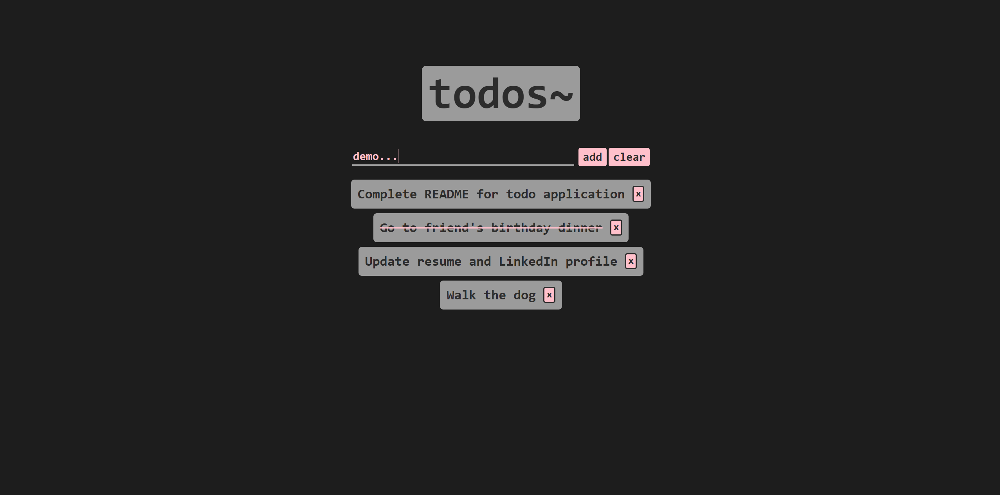

# Project-3-TodoApp

# Overview
- Simple Todo Application built entirely with HTML, CSS, and Javascript.
- Webpage provides input field for displaying todos as well as "completion" functionality.

# Website
- Here's a link to the website hosted via Github Pages! https://brandonchuck.github.io/Project-3-TodoApp/

# Preview

# Summary
This project helped me with understanding event listeners and how useful they are in every modern web application for user interaction as well as reinforcing my knowledge on DOM manipulation. Organization of the DOM and understanding how to insert elements, remove elements, and apply classes to them was crucial to creating the desire look and feel for this project. The aspect I was challenged the most by was being able to apply the appropriate classes to certain elements in order to mark them as complete. Once I was able to execute this, the following challenge was grabbing the completed elements and removing them from the DOM. I learned a lot about rendering and removing elements from the DOM based on element level criteria such as classes and ids. Overall, I am happy with techniques I learned from building this project on my own and having them in my tool belt now will be useful for future projects!

- Detailed Features:
  - Event listeners for adding todos, completing todos, deleting todos, and removing all todos.
  - Utilized flexbox properties for clean and efficient element organization

# Author
Brandon Chuck | Full Stack Developer | [LinkedIn](https://www.linkedin.com/in/brandonchuck/)
